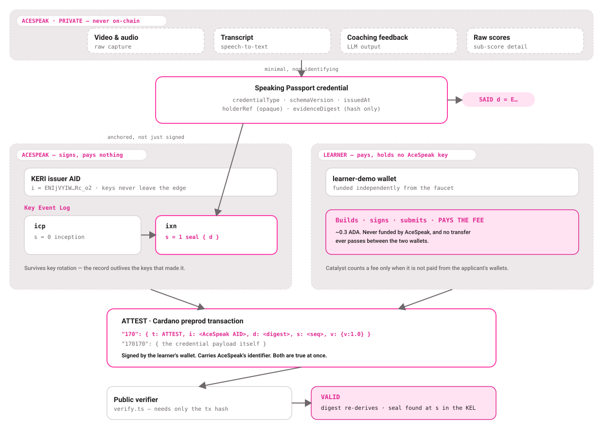

# AceSpeak — CIP-0170 preprod spike

A KERI attestation carrying **AceSpeak's** identifier, anchored on Cardano by a wallet
that is **not AceSpeak's**.

That sentence is the whole point. [CIP-0170](https://github.com/cardano-foundation/CIPs/tree/master/CIP-0170)
validates an `ATTEST` transaction entirely on the KERI side — the digest must be anchored
as a seal in the signer's Key Event Log — and says nothing about who signs or pays for the
Cardano transaction. So a learner can pay the network fee for a credential that
cryptographically names AceSpeak as its issuer.

For [Project Catalyst](https://docs.projectcatalyst.io/open-funding/funding-basics/proof-of-adoption-and-standard),
that distinction is the difference between adoption that counts and adoption that does
not: a fee counts only when it is not paid from the applicant's own wallets.

---

## The transactions

| | Transaction | Fee paid by | Counts as adoption |
|---|---|---|---|
| **`ATTEST`** | [`9f84c95d81d3ce33…`](https://preprod.cardanoscan.io/transaction/9f84c95d81d3ce338c3af0aecf2c0c87dc10ad3b75c1d77772cec7b22cd66444) | `learner-demo` — 0.183541 tADA | **Yes** |
| **`AUTH_BEGIN`** | _pending — faucet rate-limited the issuer wallet_ | `acespeak-issuer` | No, by design |

Verified against live chain data, with no API key:

```
$ npm run verify -- 9f84c95d81d3ce338c3af0aecf2c0c87dc10ad3b75c1d77772cec7b22cd66444
VALID — EABWjePbDoSvZzuuJPeasCNRQQiR3m0j0jLQwqPRBLlb is anchored in ENIjVYIWIcxMekADdujdjlmLt0m8XKDiHVLsAkdRc_o2 at sequence 4
```

**The independence is checkable on chain.** Every input to every `learner-demo`
transaction traces to the testnet faucet; `acespeak-issuer` never appears as an input, so
no value has ever flowed between the two wallets.

**A genuine INVALID example:** [`f690640a6a77a179…`](https://preprod.cardanoscan.io/transaction/f690640a6a77a17926a0f0ca272870f486c90cbabe7f07035c42e3de574d4de1) is an earlier attestation of ours
that does **not** verify — the payload digest cannot be re-derived from what the chain
returns. It is left on chain deliberately. Run the verifier against it and it reports
INVALID with the reason; see [`READINESS.md`](READINESS.md) §3.2 for what went wrong.

**Wallets** (see `artifacts/wallets-public.json`) — neither has ever sent funds to the
other, which is checkable on-chain:

- `learner-demo` — `addr_test1qz5g7xs2jghx0krqkqxrmv4d49cq5udn4sdtxyfk2g7q9u20y3axl3dkj3uhnk4w797nsw8jhdypsy5mjcey5588v0hsx9gkqm`
- `acespeak-issuer` — `addr_test1qpc8szswzp35c7f4f0znrwsvzccnxl5hrtglqq7jy3qkj0nz0m62jpesyr4rng6hmv5jjdvkjv9xur26ma3lsdhvvzrs5k33mc`

**Declared identifier** — the AID that appears in `i` on every attestation:

```
ENIjVYIWIcxMekADdujdjlmLt0m8XKDiHVLsAkdRc_o2
```

## Verify it yourself

```bash
npm ci
npm run verify -- <attestTxHash>
```

**No API key, no account, no signup.** Transaction data comes from Koios, which serves
preprod keylessly; the issuer's Key Event Log is committed at `artifacts/issuer-kel.cesr`.
No KERIA, no Docker, nothing of ours needs to be reachable. Prints each check and exits
non-zero on failure. (Set `BLOCKFROST_PROJECT_ID` to read through Blockfrost instead.)

```
  ✓ metadata carries label 170
  ✓ transaction type is ATTEST
  ✓ ATTEST carries i, d and s
  ✓ CIP version is supported
  ✓ application payload is present  (170170)
  ✓ application payload re-derives to d
  ✓ KEL parses  (2 events)
  ✓ KEL chain is intact
  ✓ KEL belongs to the signer
  ✓ KEL has an event at sequence s  (1)
  ✓ event at s anchors the digest as a seal

VALID — EGzobgWt… is anchored in ENIjVYIW… at sequence 1
```

And the negative case, which matters more:

```bash
npx tsx test/tamper-demo.ts     # alters the credential, expects INVALID
```

```
  ✗ application payload re-derives to d

INVALID — application payload digest is EAo8XYGq…, but the attestation
claims EGzobgWt… — the payload was altered after issuance
```

`npm test` runs 126 tests with no network and no Docker.



## Measured fees

`npx tsx scripts/measure-fees.ts` builds and balances each event AceSpeak will emit against
preprod protocol parameters. Cardano fees are deterministic in transaction size
(`minFeeA × size + minFeeB`), so a fully-built transaction gives the exact fee without
spending anything. Recorded in `artifacts/fee-measurements.json`.

| Event | Metadata | Signed tx | Fee |
|---|---:|---:|---:|
| Any counted `ATTEST` | ~426 B | ~633 B | **0.1834 ADA** |
| `AUTH_BEGIN` issuer setup (AceSpeak pays, not counted) | 7,797 B | 7,902 B | 0.5032 ADA |

Check the arithmetic: `44 × 633 + 155381 = 183,233` lovelace against the 183,409 charged —
the transaction builder adds a few bytes of safety margin. Sizes are of the **signed**
transaction, so every row reconciles.

Every counted event lands between 0.1832 and 0.1835 ADA — the credential payload is fixed
in shape, so the fee barely varies. A learner wallet spending more than one UTxO pays
0.0016 ADA more per extra input (measured: 0.1834 / 0.1849 / 0.1865 for one, two and three
inputs).

## How it works

1. **A credential is issued.** A minimal Speaking Passport payload — credential type,
   schema version, issue time, an opaque holder reference and a digest of the private
   assessment record. No video, transcript, personal data or raw score. It is SAIDified,
   so it carries its own self-addressing identifier.
2. **The digest is anchored, not merely signed.** An interaction event in AceSpeak's KEL
   carries the seal `{ d: <SAID> }`. Anchoring keeps the record verifiable after the
   issuer rotates keys — which matters for a credential meant to outlive the learner's
   subscription.
3. **The learner submits the transaction.** Metadata label `170` carries `t/i/d/s/v`; the
   credential itself sits at the sibling application label. The learner's wallet signs and
   pays. AceSpeak's keys are nowhere near it.
4. **Anyone verifies.** Re-derive the payload's SAID, confirm it equals `d`, find the KEL
   event at sequence `s`, confirm it anchors that seal.

Read [`READINESS.md`](READINESS.md) before drawing conclusions: it states exactly what is
and is not verified, two places where the spec left gaps we had to fill, and the toolchain
rough edges we hit.

## Reproducing from scratch

Requires Docker. No Blockfrost key — Koios serves preprod keylessly for both reading and
submitting, so the only external step is funding the wallets from the faucet.

> **On Apple Silicon**, start Colima with Rosetta — the witness image is amd64-only and
> fails under qemu with an LMDB error that does not mention emulation:
> ```bash
> colima start --vm-type=vz --vz-rosetta --cpu 4 --memory 8
> ```

```bash
cp .env.example .env
docker compose up --wait      # keria, witness pool, schema server

npm run wallets               # generate both wallets, then fund each from the faucet
npm run incept                # create the issuer AID  -> save KERI_BRAN to .env
npm run anchor                # issue a credential and anchor its digest
npm run finish                # submit both, verify, record the hashes
```

Fund `learner-demo` **first** — the faucet rate-limits, and that is the wallet whose fee
carries the claim. Never move funds between the two wallets.

## Layout

| Path | |
|---|---|
| `src/verify.ts` | The verifier. Library plus CLI. |
| `src/cardano/metadata.ts` | CIP-0170 builders, 64-byte chunking, submission guard. |
| `src/keri/credential.ts` | Speaking Passport payload; refuses to carry personal data. |
| `src/keri/kel.ts` | CESR stream parser and seal lookup. |
| `src/cardano/chain.ts` | Keyless preprod reads via Koios. |
| `schema/` | Communication Credential Profile v1 (draft), SAIDified and served by SAID. |
| `artifacts/` | The evidence: issuer AID, KEL, credential, transactions. |

## Context

Built for AceSpeak's Catalyst Pilot application. AceSpeak is a live iOS and Android
speaking-practice product with paying subscribers; this spike is the integration work the
grant would fund, de-risked before submission.

**Team Cardano track record.** The same team has **8 merged pull requests to
[`bloxbean/yaci-devkit`](https://github.com/bloxbean/yaci-devkit/pulls?q=is%3Apr+author%3Awistkeylab)**
— the local Cardano devnet used across the ecosystem — landed between February and May 2026
under the [`wistkeylab`](https://github.com/wistkeylab) account, which is Wistkey Lab's shared
engineering account. This repository sits under the Wistkey organisation; both are the same team.

Stated precisely rather than oversold: those are contributions to a Cardano developer tool's web
UI, not shipped KERI signing. The honest claim is that the team already works inside Cardano
tooling and has upstreamed accepted code, and that CIP-0170 attestation signing is the new work.

## References

- [CIP-0170 specification](https://github.com/cardano-foundation/CIPs/tree/master/CIP-0170) · [merged PR #1113](https://github.com/cardano-foundation/CIPs/pull/1113)
- [Catalyst CIP-0170 integration guide](https://docs.projectcatalyst.io/open-funding/funding-basics/integration-guides/on-chain-identity-cip-0170)
- [signify-ts](https://github.com/WebOfTrust/signify-ts) · [KERIA](https://github.com/WebOfTrust/keria) · [cf-signify-java](https://github.com/cardano-foundation/cf-signify-java)

## Licence

Apache-2.0.
