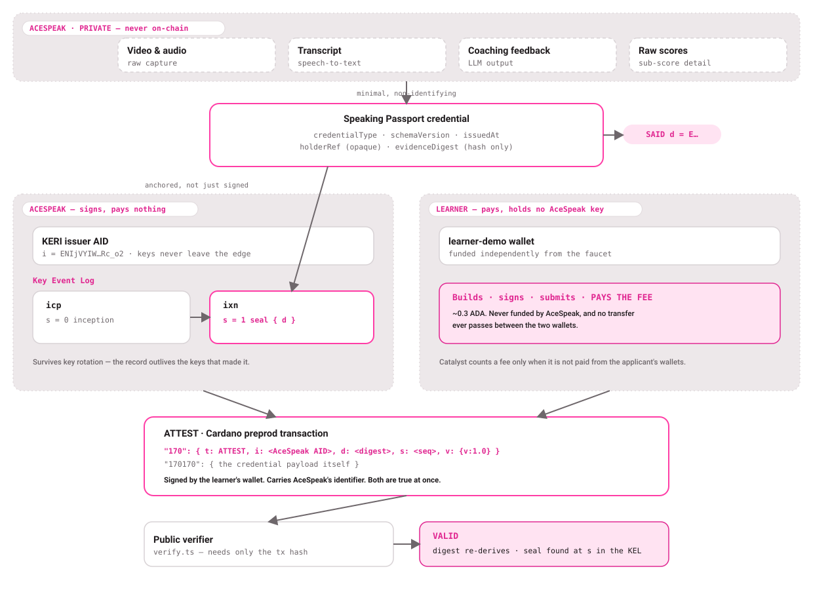

# AceSpeak — CIP-0170 preprod spike

[](https://github.com/Wistkey/acespeak-cip0170-spike/actions/workflows/verify.yml)

A KERI attestation carrying **AceSpeak's** identifier, anchored on Cardano by a wallet
that is **not AceSpeak's**.

That sentence is the whole point. [CIP-0170](https://github.com/cardano-foundation/CIPs/tree/master/CIP-0170)
validates an `ATTEST` transaction entirely on the KERI side — the digest must be anchored
as a seal in the signer's Key Event Log — and says nothing about who signs or pays for the
Cardano transaction. So a learner can pay the network fee for a credential that
cryptographically names AceSpeak as its issuer.

For [Project Catalyst](https://docs.projectcatalyst.io/open-funding/funding-basics/proof-of-adoption-and-standard),
that distinction is the difference between adoption that counts and adoption that does
not: a fee counts only when it is not paid from the applicant's own wallets.

---

## The transactions

| | Transaction | Fee paid by | Counts as adoption |
|---|---|---|---|
| **`ATTEST`** | [`046c0ce93e03ed6d…`](https://preprod.cardanoscan.io/transaction/046c0ce93e03ed6d6f709d8930f2611943b5d93c202aca6263bd38b9a5ca39dc) | `learner-demo` — 0.183541 tADA | **Yes** |
| **`AUTH_BEGIN`** | [`123c5d18bb2317fd…`](https://preprod.cardanoscan.io/transaction/123c5d18bb2317fdbdc85eb10e1f862591590c224113936a038835cd1ba7270d) | `acespeak-issuer` — 0.632693 tADA | No, by design |

Verified against live chain data, with no API key:

```
$ npm run verify -- 046c0ce93e03ed6d6f709d8930f2611943b5d93c202aca6263bd38b9a5ca39dc
VALID — EDecNwxqIqXMxbujZxf0KUxbOQAzNi3uhinI_AO0UsOU is anchored in ENIjVYIWIcxMekADdujdjlmLt0m8XKDiHVLsAkdRc_o2 at sequence 6
```

**The independence is checkable on chain.** Every input to every `learner-demo`
transaction traces to the testnet faucet; `acespeak-issuer` never appears as an input, so
no value has ever flowed between the two wallets.

**Two genuine INVALID examples, left on chain deliberately.** Both look well-formed and
neither can ever verify:

- [`f690640a6a77a179…`](https://preprod.cardanoscan.io/transaction/f690640a6a77a17926a0f0ca272870f486c90cbabe7f07035c42e3de574d4de1) — digested a JSON serialisation in one key order, while indexer
  APIs return another.
- [`9f84c95d81d3ce33…`](https://preprod.cardanoscan.io/transaction/9f84c95d81d3ce338c3af0aecf2c0c87dc10ad3b75c1d77772cec7b22cd66444) — digested a canonicalised JSON form. Better, but still not what
  CIP-0170 settled on.

Both are superseded by the rule this spike's findings prompted: **`d` digests the payload's
on-chain CBOR bytes.** Run the verifier against either and it reports INVALID with the reason.
[`READINESS.md`](READINESS.md) §3.2 has the account, and the fix is now in the spec —
[cardano-foundation/CIPs#1253](https://github.com/cardano-foundation/CIPs/pull/1253).

**Wallets** (see `artifacts/wallets-public.json`) — neither has ever sent funds to the
other, which is checkable on-chain:

- `learner-demo` — `addr_test1qz5g7xs2jghx0krqkqxrmv4d49cq5udn4sdtxyfk2g7q9u20y3axl3dkj3uhnk4w797nsw8jhdypsy5mjcey5588v0hsx9gkqm`
- `acespeak-issuer` — `addr_test1qpc8szswzp35c7f4f0znrwsvzccnxl5hrtglqq7jy3qkj0nz0m62jpesyr4rng6hmv5jjdvkjv9xur26ma3lsdhvvzrs5k33mc`

**Declared identifier** — the AID that appears in `i` on every attestation:

```
ENIjVYIWIcxMekADdujdjlmLt0m8XKDiHVLsAkdRc_o2
```

## Verify it yourself

```bash
npm ci
npm run verify -- <attestTxHash>
```

**No API key, no account, no signup.** The transaction's **raw CBOR** comes from Koios, which
serves preprod keylessly — CIP-0170 requires digesting on-chain bytes, and forbids recomputing
`d` from a JSON view; the issuer's Key Event Log is committed at `artifacts/issuer-kel.cesr`.
No KERIA, no Docker, nothing of ours needs to be reachable. Prints each check and exits
non-zero on failure. (Set `BLOCKFROST_PROJECT_ID` to read through Blockfrost instead.)

```
  ✓ metadata carries label 170
  ✓ transaction type is ATTEST  (ATTEST)
  ✓ ATTEST carries i, d and s
  ✓ CIP version is supported  (1.0)
  ✓ application payload is present  (170170)
  ✓ payload CBOR digests to d  (EDecNwxqIqXMxbujZxf0KUxbOQAzNi3uhinI_AO0UsOU)
  ✓ KEL parses  (7 events)
  ✓ KEL chain is intact
  ✓ KEL belongs to the signer  (ENIjVYIWIcxMekADdujdjlmLt0m8XKDiHVLsAkdRc_o2)
  ✓ KEL has an event at sequence s  (6)
  ✓ event at s anchors the digest as a seal

VALID — EDecNwxqIqXMxbujZxf0KUxbOQAzNi3uhinI_AO0UsOU is anchored in ENIjVYIWIcxMekADdujdjlmLt0m8XKDiHVLsAkdRc_o2 at sequence 6
```

And the negative case, which matters more:

```bash
npx tsx test/tamper-demo.ts     # alters the credential, expects INVALID
```

```
  ✗ application payload re-derives to d

INVALID — application payload digest is EPTKfkai6M8xM_FbEAd_nMtW-kL_KeEzWUPBhaE8z5-v,
but the attestation claims EABWjePbDoSvZzuuJPeasCNRQQiR3m0j0jLQwqPRBLlb — the payload
was altered after issuance
```

`npm test` runs 139 tests with no network and no Docker — and CI runs them on a clean
Ubuntu runner with Node 20, so that claim is checkable rather than asserted.

**Cross-check the committed KEL against a live witness.** The default verifies against
`artifacts/issuer-kel.cesr`, which we control — so the repo also supports resolving the KEL
live and confirming the two agree:

```bash
npm run verify -- <attestTxHash> --oobi http://localhost:5642/oobi/<AID>/witness
```

Both paths return VALID against the same digest and sequence number. The witness runs from
this repo's `docker-compose.yaml`; it is localhost-only, which is exactly why the KEL is
committed. See [`READINESS.md`](READINESS.md) §5.



## Measured fees

`npx tsx scripts/measure-fees.ts` builds and balances each event AceSpeak will emit against
preprod protocol parameters. Cardano fees are deterministic in transaction size
(`minFeeA × size + minFeeB`), so a fully-built transaction gives the exact fee without
spending anything. Recorded in `artifacts/fee-measurements.json`.

| Event | Metadata | Signed tx | Modelled | **Actually charged on chain** |
|---|---:|---:|---:|---:|
| Any counted `ATTEST` | ~426 B | ~633 B | 0.183365 | **0.183541 ADA** |
| `AUTH_BEGIN` issuer setup (AceSpeak pays, not counted) | 11,339 B | 10,840 B | 0.632517 | **0.632693 ADA** |

Both modelled figures land within 176 lovelace of what the network actually charged, which
is the transaction builder's safety margin. The model was built before either transaction
was submitted, so this is a genuine prediction rather than a fit.

Check the arithmetic yourself: `44 × 633 + 155381 = 183,233` lovelace against 183,541
charged. Sizes are of the **signed** transaction, so every row reconciles.

`AUTH_BEGIN`'s fee scales with the credential chain, which grows as credentials are issued
into the registry — 10,110 bytes at the time of publishing. `ATTEST` does not: the payload
is fixed in shape, which is why the counted fee is stable to four decimal places.

A learner wallet spending more than one UTxO pays 0.0016 ADA more per extra input
(measured: 0.1834 / 0.1849 / 0.1865 for one, two and three inputs).

## How it works

1. **A credential is issued.** A minimal Speaking Passport payload — credential type,
   schema version, issue time, an opaque holder reference and a digest of the private
   assessment record. No video, transcript, personal data or raw score. It is SAIDified,
   so it carries its own self-addressing identifier.
2. **The digest is anchored, not merely signed.** An interaction event in AceSpeak's KEL
   carries the seal `{ d: <SAID> }`. Anchoring keeps the record verifiable after the
   issuer rotates keys — which matters for a credential meant to outlive the learner's
   subscription.
3. **The learner submits the transaction.** Metadata label `170` carries `t/i/d/s/v`; the
   credential itself sits at the sibling application label. The learner's wallet signs and
   pays. AceSpeak's keys are nowhere near it.
4. **Anyone verifies.** Digest the payload's raw CBOR bytes, confirm the result equals `d`,
   find the KEL event at sequence `s`, confirm it anchors that seal. Note step 2 happens
   before the transaction exists, so `03-attest.ts` re-checks the built transaction's bytes
   against the anchor before spending — a KEL anchor cannot be retracted.

Read [`READINESS.md`](READINESS.md) before drawing conclusions: it states exactly what is
and is not verified, two places where the spec left gaps we had to fill, and the toolchain
rough edges we hit.

## Reproducing from scratch

Requires Docker. No Blockfrost key — Koios serves preprod keylessly for both reading and
submitting, so the only external step is funding the wallets from the faucet.

> **On Apple Silicon**, start Colima with Rosetta — the witness image is amd64-only and
> fails under qemu with an LMDB error that does not mention emulation:
> ```bash
> colima start --vm-type=vz --vz-rosetta --cpu 4 --memory 8
> ```

```bash
cp .env.example .env
docker compose up --wait      # keria, witness pool, schema server

npm run wallets               # generate both wallets, then fund each from the faucet
npm run incept                # create the issuer AID  -> save KERI_BRAN to .env
npm run anchor                # issue a credential and anchor its digest
npm run finish                # submit both, verify, record the hashes
```

Fund `learner-demo` **first** — the faucet rate-limits, and that is the wallet whose fee
carries the claim. Never move funds between the two wallets.

## Layout

| Path | |
|---|---|
| `src/verify.ts` | The verifier. Library plus CLI. |
| `src/cardano/metadata.ts` | CIP-0170 builders, 64-byte chunking, submission guard. |
| `src/keri/credential.ts` | Speaking Passport payload; refuses to carry personal data. |
| `src/keri/kel.ts` | CESR stream parser and seal lookup. |
| `src/cardano/chain.ts` | Keyless preprod reads via Koios. |
| `src/cardano/cbor.ts` | CIP-0170 digest over on-chain CBOR bytes. |
| `schema/` | Communication Credential Profile v1 (draft), SAIDified and served by SAID. |
| `artifacts/` | The evidence: issuer AID, KEL, credential, transactions. |

## Context

Built for AceSpeak's Catalyst Pilot application. AceSpeak is a live iOS and Android
speaking-practice product with paying subscribers; this spike is the integration work the
grant would fund, de-risked before submission.

**Team Cardano track record.** The same team has **8 merged pull requests to
[`bloxbean/yaci-devkit`](https://github.com/bloxbean/yaci-devkit/pulls?q=is%3Apr+author%3Awistkeylab)**
— the local Cardano devnet used across the ecosystem — landed between February and May 2026
under the [`wistkeylab`](https://github.com/wistkeylab) account, which is Wistkey Lab's shared
engineering account. This repository sits under the Wistkey organisation; both are the same team.

Stated precisely rather than oversold: those are contributions to a Cardano developer tool's web
UI, not shipped KERI signing. The honest claim is that the team already works inside Cardano
tooling and has upstreamed accepted code, and that CIP-0170 attestation signing is the new work.

## References

- [CIP-0170 specification](https://github.com/cardano-foundation/CIPs/tree/master/CIP-0170) · [merged PR #1113](https://github.com/cardano-foundation/CIPs/pull/1113)
- [Catalyst CIP-0170 integration guide](https://docs.projectcatalyst.io/open-funding/funding-basics/integration-guides/on-chain-identity-cip-0170)
- [signify-ts](https://github.com/WebOfTrust/signify-ts) · [KERIA](https://github.com/WebOfTrust/keria) · [cf-signify-java](https://github.com/cardano-foundation/cf-signify-java)

## Licence

Apache-2.0.
